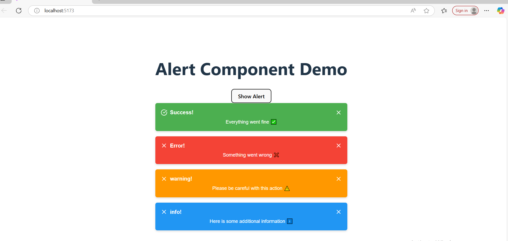

# 🚀 Alert Project (React + TypeScript + Vite)

This project is a **reusable alert component** built using:
- ⚛️ React
- 🟦 TypeScript
- ⚡ Vite
- 🎨 SCSS
- 📦 Lucide Icons

---

## 📂 Features
- ✅ Supports multiple alert types: **Success, Error, Warning, Info**.
- ⏳ Auto-dismiss after 3 seconds or manual close button.
- 🎨 Styled using CSS Modules for better modularity.
- 🛠️ Easy to integrate into any React project.

---

## 🖼️ Project Preview



---

## 🔧 Getting Started

### 1️⃣ Clone the repository
```bash
git clone https://github.com/MohammedSZD/alert-project.git
